# Biểu Đồ Hoạt Động Recon Tool

File này mô tả luồng hoạt động của toàn bộ recon tool bằng Mermaid. Có thể xem trực tiếp trên GitHub vì GitHub hỗ trợ render Mermaid trong Markdown.

## 1. Luồng Tổng Quan

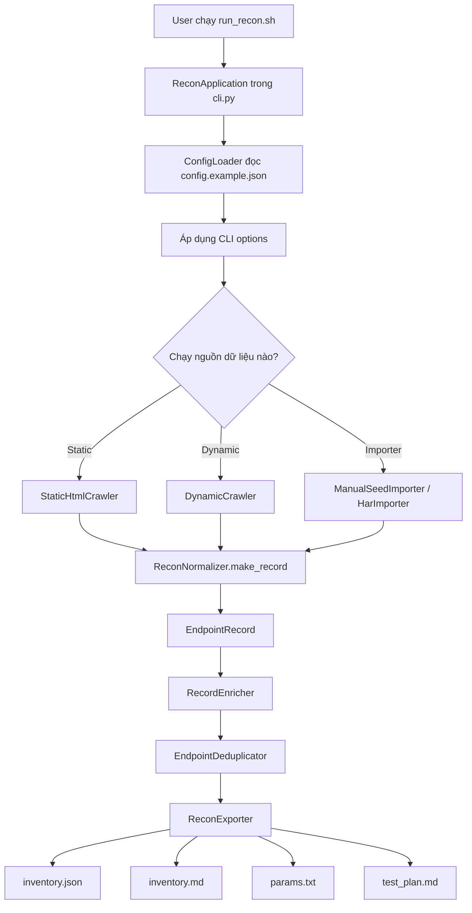

## 2. Luồng CLI Chính

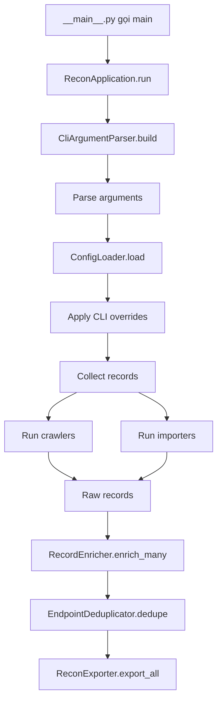

## 3. Luồng Static Crawler

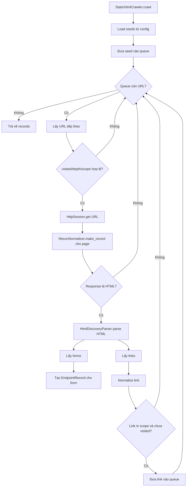

## 4. Luồng Dynamic Crawler

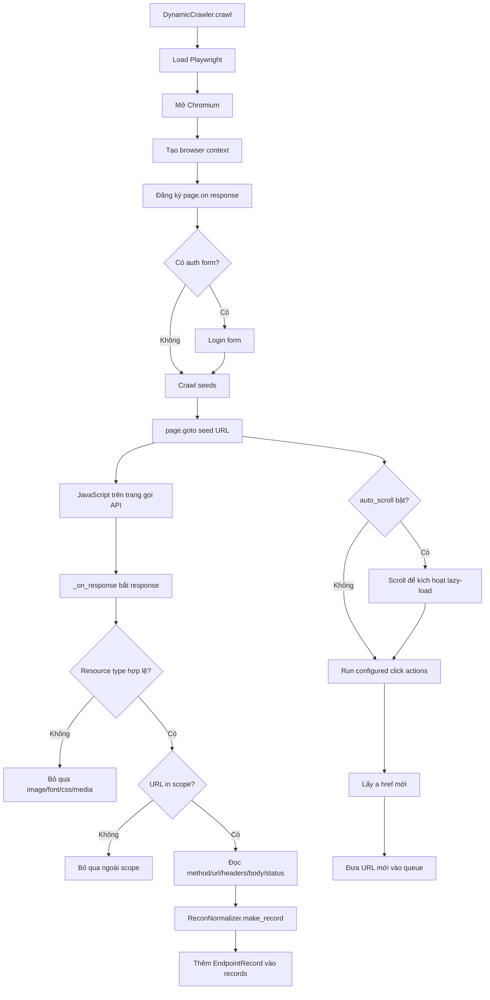

## 5. Luồng Normalize Dữ Liệu

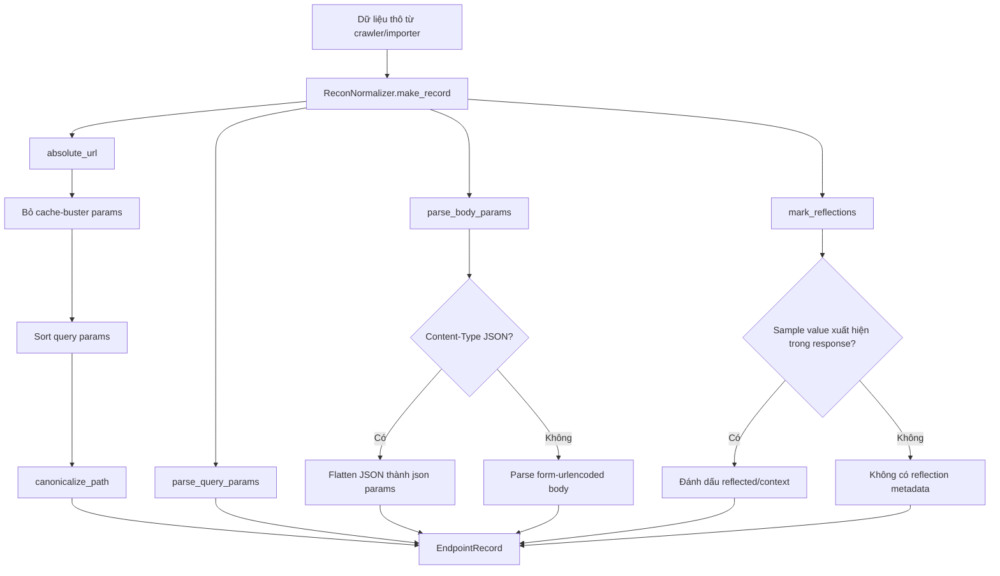

## 6. Luồng Lọc Dữ Liệu

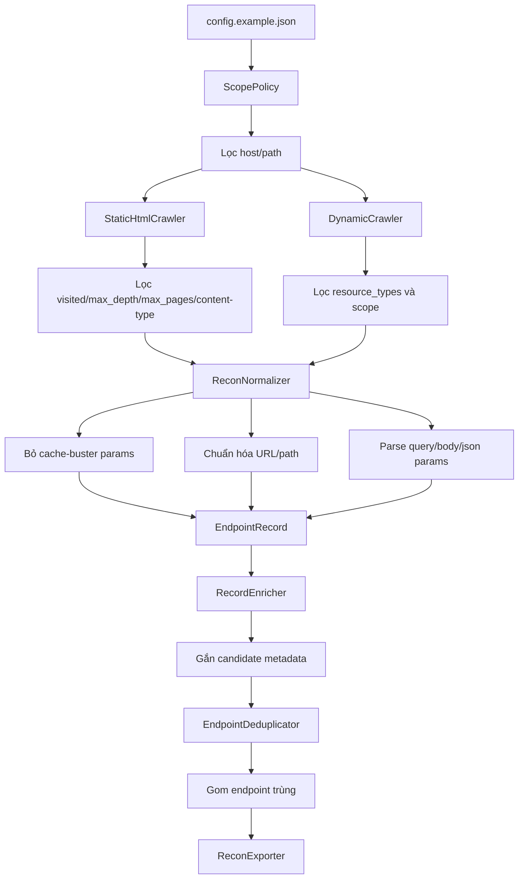

## 7. Luồng Dedupe

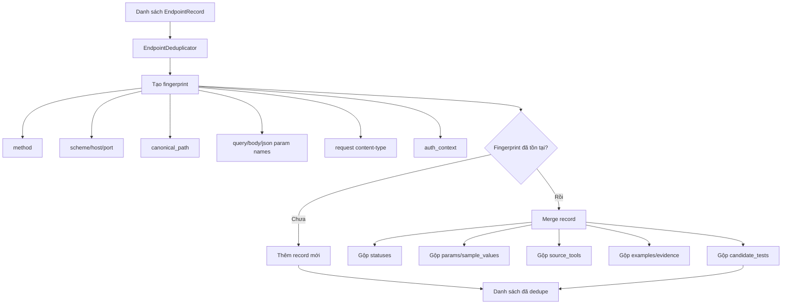

## 8. Luồng Enrich Candidate

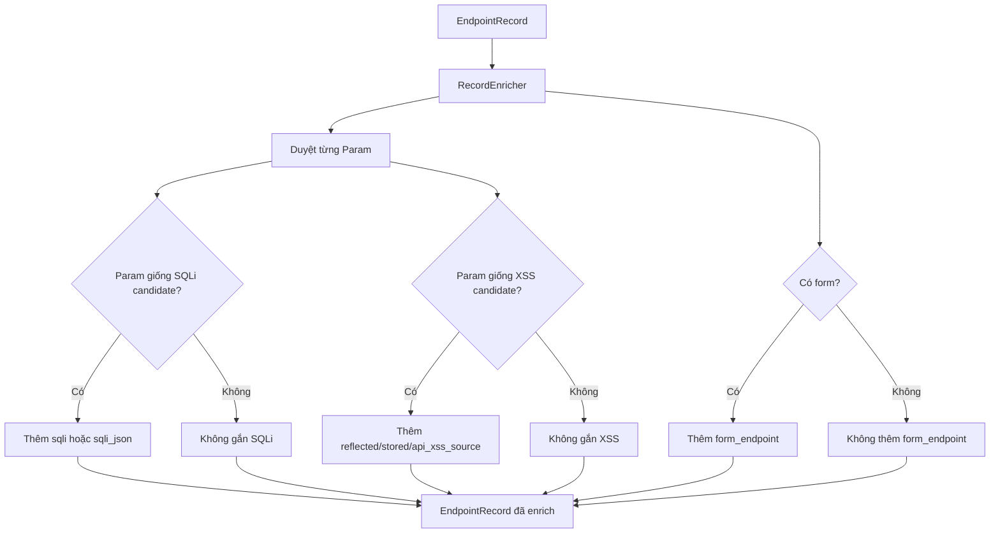

## 9. Luồng Export

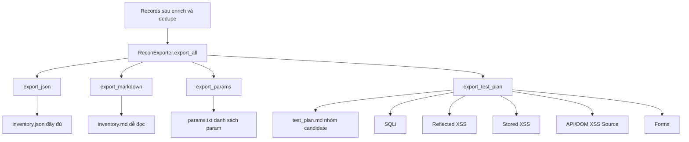

## 10. Sơ Đồ Class Chính

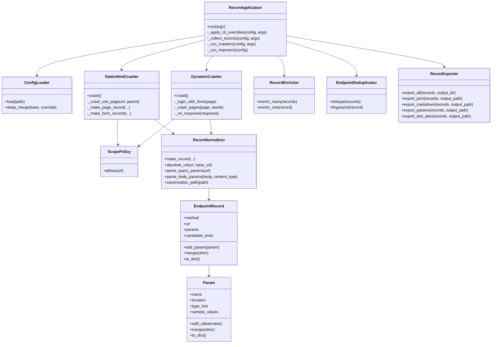

## 11. Luồng Dữ Liệu Rút Gọn

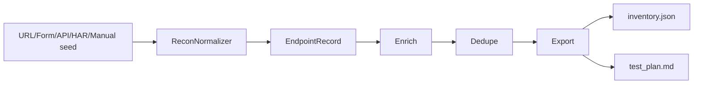
