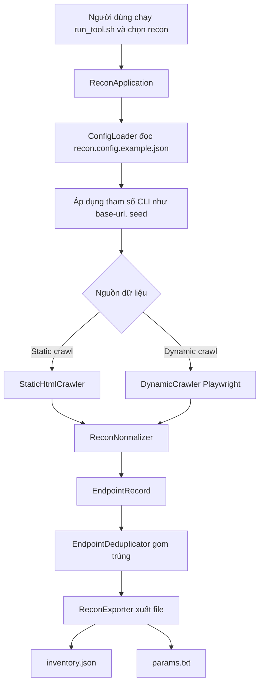
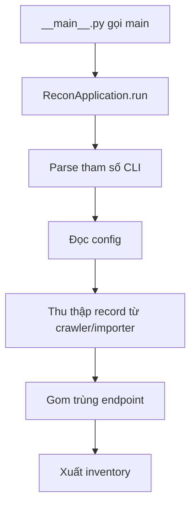
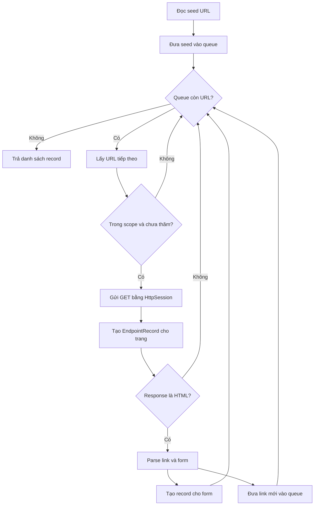
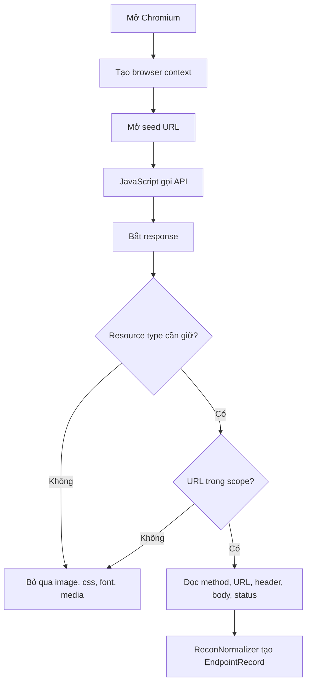
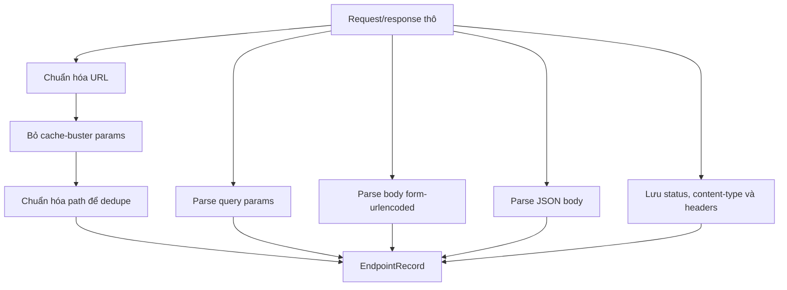
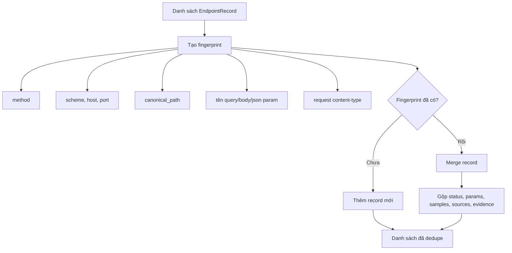
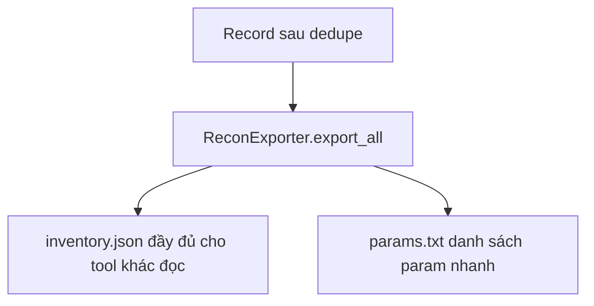
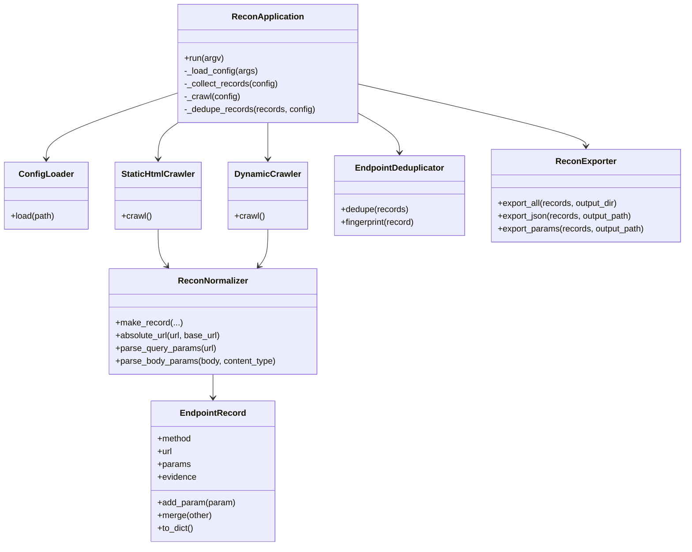

# Biểu Đồ Hoạt Động Recon Tool

File này mô tả luồng hoạt động của `recontool` bằng Mermaid. Recon chỉ thu thập và chuẩn hóa dữ liệu đã quan sát được, không gửi payload kiểm thử và không tự gợi ý loại lỗ hổng cần test.

## 1. Luồng Tổng Quan

## 2. Luồng CLI

## 3. Static Crawler

Static crawler đọc HTML thuần, lấy link và form nhưng không chạy JavaScript.

## 4. Dynamic Crawler

Dynamic crawler mở Chromium bằng Playwright để bắt request sinh bởi JavaScript, fetch hoặc XHR của SPA.

## 5. Chuẩn Hóa Dữ Liệu

`ReconNormalizer` biến dữ liệu thô từ mọi nguồn thành cùng một format `EndpointRecord`.

## 6. Gom Trùng Endpoint

`EndpointDeduplicator` tạo fingerprint cho từng endpoint. Nếu fingerprint giống nhau, record được merge để tránh trùng dữ liệu.

## 7. Xuất Kết Quả

## 8. Class Chính

