# Biểu Đồ Hoạt Động Recon Tool

File này mô tả luồng hoạt động của toàn bộ recon tool bằng Mermaid. GitHub có thể render trực tiếp các biểu đồ trong file Markdown này.

Ghi chú:

- Các tên class như `ReconApplication`, `StaticHtmlCrawler`, `EndpointRecord` được giữ nguyên để đối chiếu với source code.
- Các bước xử lý, điều kiện và nhãn mũi tên được viết bằng tiếng Việt.
- Tool này chỉ làm recon: thu thập, chuẩn hóa, gắn metadata, gom trùng và xuất báo cáo.

## 1. Luồng Tổng Quan

Biểu đồ này cho thấy toàn bộ pipeline từ lúc người dùng chạy tool đến lúc sinh file kết quả.

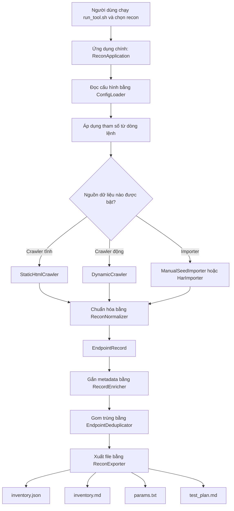

## 2. Luồng CLI Chính

Biểu đồ này mô tả file `cli.py`. Đây là nơi điều phối các bước chính của tool.

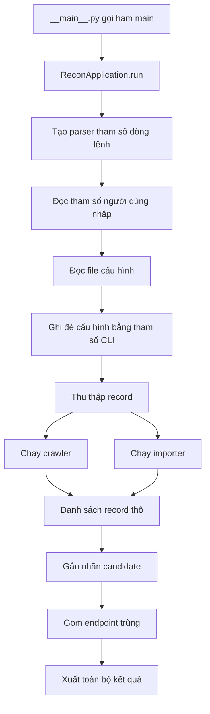

## 3. Luồng Static Crawler

Static crawler đọc HTML không chạy JavaScript. Nó phù hợp với trang server-rendered, link HTML và form HTML.

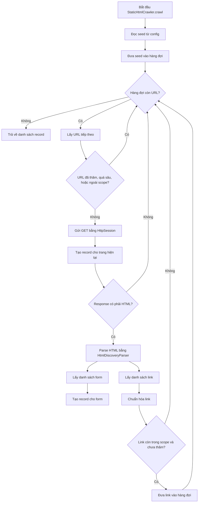

## 4. Luồng Dynamic Crawler

Dynamic crawler chạy Chromium bằng Playwright. Nó dùng để bắt request sinh ra bởi JavaScript, đặc biệt là fetch/XHR của SPA.

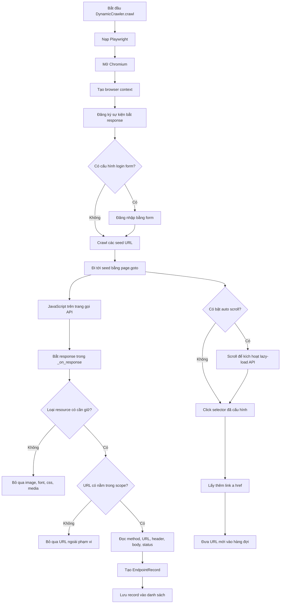

## 5. Luồng Chuẩn Hóa Dữ Liệu

`ReconNormalizer` là nơi biến dữ liệu thô từ crawler/importer thành `EndpointRecord`.

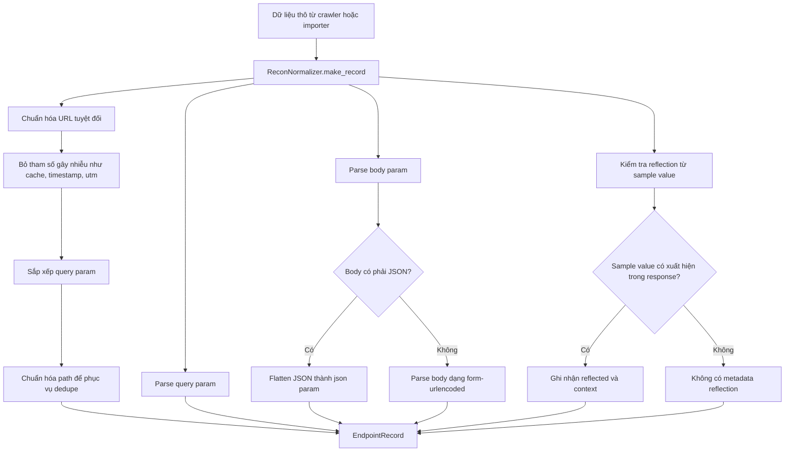

## 6. Luồng Lọc Dữ Liệu

Biểu đồ này mô tả các lớp lọc dữ liệu: lọc scope, lọc resource, lọc tham số gây nhiễu và gom trùng endpoint.

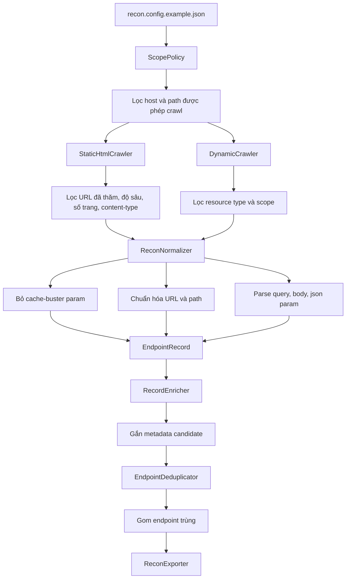

## 7. Luồng Gom Trùng Endpoint

`EndpointDeduplicator` tạo fingerprint cho từng endpoint. Nếu fingerprint giống nhau, record sẽ được merge.

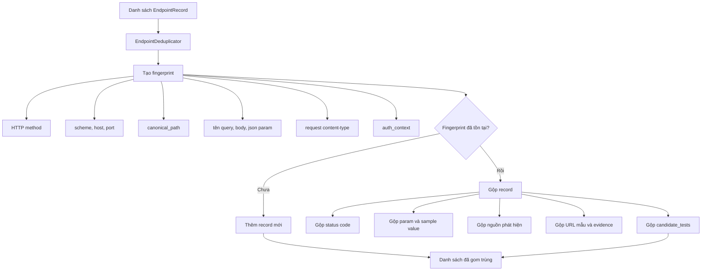

## 8. Luồng Gắn Nhãn Candidate

`RecordEnricher` chỉ gắn metadata gợi ý. Nó không kết luận có lỗ hổng và không gửi giá trị kiểm thử.

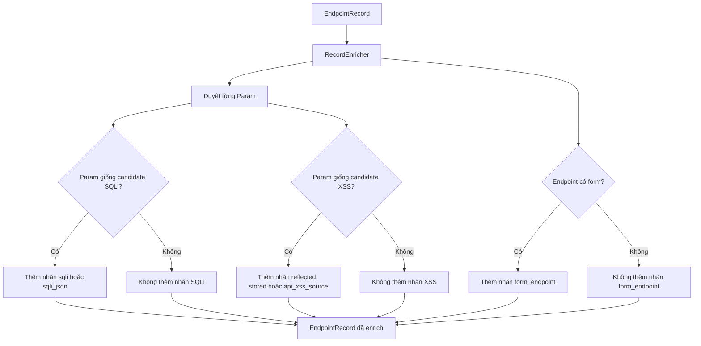

## 9. Luồng Xuất Kết Quả

`ReconExporter` tạo các file kết quả từ danh sách record đã enrich và dedupe.

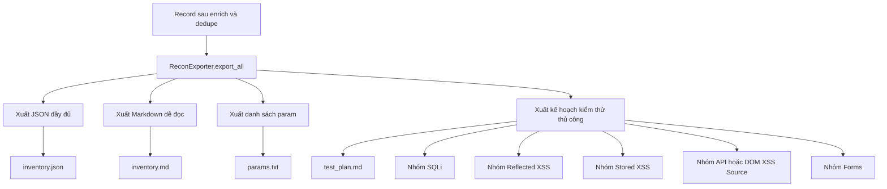

## 10. Sơ Đồ Class Chính

Biểu đồ này giữ tên class/method bằng tiếng Anh vì chúng trùng với source code. Phần quan hệ thể hiện class nào gọi hoặc phụ thuộc class nào.

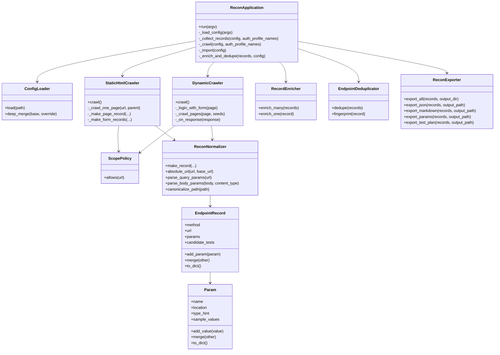

## 11. Luồng Dữ Liệu Rút Gọn

Biểu đồ cuối cùng là bản rút gọn để nhớ nhanh: mọi nguồn dữ liệu đều được chuẩn hóa thành `EndpointRecord`, sau đó enrich, dedupe và export.

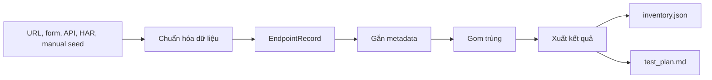
